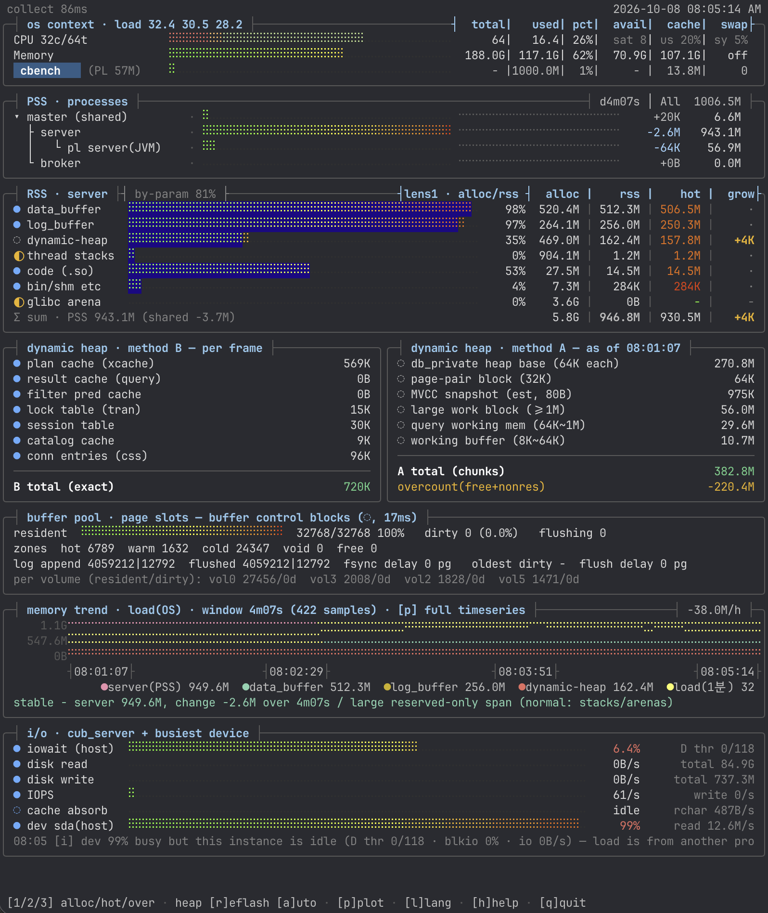
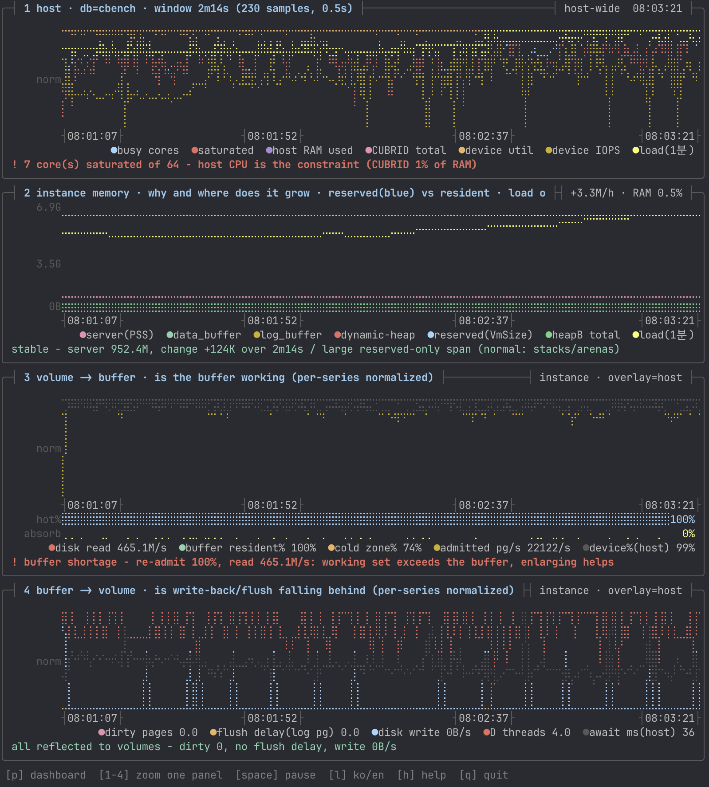
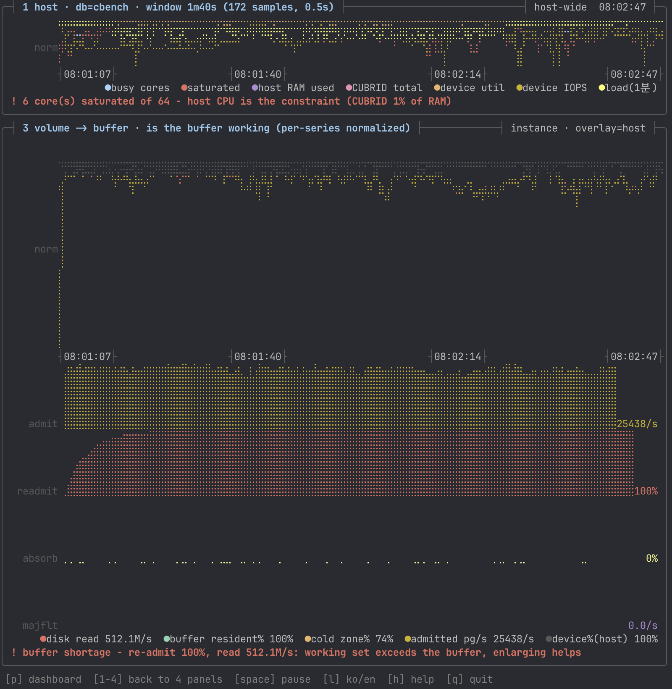

# cub_top

CUBRID 서버가 메모리를 **어디에 얼마나** 쓰고 있는지 `cubrid.conf` 파라미터 이름으로 보여주는 진단 유틸리티.
cub_top 자신은 **서버에 접속하지 않고** `/proc` 과 프로세스 메모리를 읽는다. 서버에 묻는 것은
시작할 때 `cubrid paramdump` 1회(실제 적용 중인 파라미터)뿐이며, `CUBRID` 환경변수가 없으면 이것도 생략한다.

## 무엇을 푸는가

`top` 은 `cub_server` 가 1GB 를 쓴다고만 알려준다. 그 1GB 가 데이터 버퍼인지, 플랜 캐시인지,
설정을 초과한 것인지는 알려주지 않는다.

| 질문 | 답하는 방식 |
|---|---|
| 이 메모리가 어느 파라미터 몫인가 | 영역별 매핑을 `data_buffer_size` 등 설정 크기와 대조 |
| 설정으로 설명 안 되는 몫은 무엇인가 | 동적 힙을 서브시스템별로 분해 (방법 B=엔진 직독, A=청크 추정) |
| 설정값을 초과했는가 | `alloc / cfg` 비율 + 초과가 정상인 이유 병기 |
| 실제로 쓰이는 부분은 얼마인가 | 상주 페이지 중 최근 접근 비율(`--hot`) |
| 버퍼가 제 역할을 하는가 | 버퍼 상주율과 디스크 읽기량의 관계 + 한 줄 판정문 |
| 증설·축소 중 무엇이 답인가 | 수요·관측 상한·헤드룸 + 재적재율로 "버퍼 부족"과 "스캔" 구분 |
| 어느 DB 가 얼마를 쓰는가 | 인스턴스별 집계(브로커·CAS·PL 포함) |
| 어느 페이지가 버퍼풀에 올라와 있는가 | BCB 직독 → `--bcb-dump` → `cub_volmap --bufmap` 으로 볼륨 지도에 중첩 |
| 장애 순간을 나중에 다시 볼 수 있는가 | `--record` 로 기록, `--replay` 로 어디서든 재생 |

## 특징

| | |
|---|---|
| **대상에 쓰기 0** | 서버 정지·디버거·파라미터 변경·락 없음. 서버 질의는 시작 시 `paramdump` 1회뿐. 유일한 쓰기 예외 `clear_refs`(`--hot`)는 기본 OFF |
| **의존 0** | 단일 파일 C99, libelf/libdw 미링크. `<elf.h>` 는 선언만 사용 |
| **파일 하나로 전 버전** | 10.0~11.5 오프셋 표를 바이너리에 내장 — 바이너리만 복사해도 구버전에서 동작 |
| **자기검증 없이 값을 내지 않음** | 오프셋 표는 후보일 뿐. 그 환경에서 검증 실패 시 **그 기능만** 끄고 사유를 적는다 |
| **신뢰도를 숨기지 않음** | `●` 측정 / `◐` 예약 / `◌` 추정 / `?` 미귀속 을 행마다 표기 |
| **엔진 어휘로 표기** | `anon`·`file-backed` 가 아니라 `data_buffer`·`plan cache` 로 |
| **관측이 대상을 위협하지 않음** | 취합이 0.5초 예산을 넘으면 그 프레임을 버리고 화면에 알린다 |

## 빌드

빌드 산출물은 리포에 두지 않는다 — 어느 커밋·툴체인으로 만들어졌는지 확인할 수 없고,
소스를 고쳐도 따라 갱신되지 않기 때문이다. 의존성이 없어 빌드는 한 줄이다.

```sh
sh tools/build.sh           # 동적 (현재 시스템, 가장 호환성 높음)
sh tools/build.sh static    # 정적 단독 바이너리
sh tools/build.sh legacy    # 구 시스템(CentOS 6 등) — 대상에서 직접 빌드할 것
```

**CUBRID 소스도 헤더도 필요 없다.** libc 만 있으면 된다.

> 정적 빌드는 *빌드 환경 glibc 가 요구하는 커널 버전* 이상에서만 돈다.
> `readelf -n cub_top` 의 `NT_GNU_ABI_TAG` 로 하한을 확인한다.

## 사용

```sh
./cub_top -t                   # 드릴다운 트리 (터미널용, 1회 출력)
./cub_top -d                   # key=value 덤프 (모니터링 연동)
./cub_top --dump-json          # -d 와 같은 내용·같은 순서를 JSON 으로
./cub_top -b                   # btop형 대시보드 (라이브, -i 와 같음)
./cub_top -p                   # 시계열 플롯 (4패널, p 로 대시보드와 전환)
./cub_top -t --heap            # 트리에 동적 힙 분해까지 (방법 A 포함)
./cub_top -t <db명>            # 그 DB 를 본다 (생략 시 알파벳순 첫 번째)
./cub_top                      # 도움말 (옵션 목록) — -h, --help 와 같음
```



라이브 대시보드(`-b`) — 위에서부터 OS 컨텍스트, 프로세스별 PSS, 서버 메모리의 파라미터 귀속
(`alloc`·`rss`·`hot`), 동적 힙 분해(왼쪽 방법 B 엔진 직독, 오른쪽 방법 A 청크 추정), 버퍼풀 슬롯(BCB)
직독, 메모리 추이, I/O 와 판정문 순이다. 이 화면(`cbench`)에서는:

| 상자 | 읽는 법 |
|---|---|
| RSS · server | `data_buffer` 는 설정 크기 520.4M 중 512.3M 가 상주한다(alloc/rss 98%). `glibc arena` 3.6G 는 예약만 하고 상주 0 이다 |
| dynamic heap | 방법 B 합계 720K(플랜 캐시 569K 포함)는 엔진 변수를 직접 읽은 정확값이다. 방법 A 382.8M 중 −220.4M 는 free·비상주 청크라 상한으로 읽는다 |
| buffer pool | 32,768 슬롯이 모두 찼고(100%) 그중 cold 존이 24,347 — 버퍼가 가득 찬 채 페이지가 교체되고 있다 |
| memory trend | 4분 7초 동안 서버 변화 −2.6M, 안정 |
| i/o | 장치(sda)는 99% 바쁘지만 이 순간 이 인스턴스의 디스크 I/O 는 0B/s 라, 판정문이 부하를 **다른 프로세스**로 돌린다 |



시계열 플롯(`-p`) — 같은 데이터를 시간축으로 본다. 네 패널이 데이터가 흐르는 순서를 따르고, 패널마다
아래에 한 줄 판정문이 붙는다.

| 패널 | 묻는 것 | 이 화면의 판정 |
|---|---|---|
| 1 host | 호스트 자원 중 무엇이 제약인가 | 64 코어 중 7개 포화 — 호스트 CPU 가 제약(CUBRID 는 RAM 의 1%) |
| 2 instance memory | 서버 메모리가 왜·어디서 늘어나는가 | 안정 — 2분 14초 동안 +124K |
| 3 volume → buffer | 읽기 경로: 버퍼가 제 역할을 하는가 | **버퍼 부족** — 재적재 100%, 읽기 465.1M/s: 작업집합이 버퍼보다 커서 증설이 듣는다 |
| 4 buffer → volume | 쓰기 경로: write-back 이 밀리는가 | 볼륨 반영 완료 — dirty 0, flush 지연 없음, 쓰기 0B/s |

`2`~`4` 는 그 패널을 확대하고(호스트 패널은 위에 축소해 남는다), `1` 로 4패널에 돌아온다. `p` 로 대시보드와 오간다.
확대하면 아래에 보조 막대가 붙어, 판정의 근거가 된 값을 같은 시간축에서 볼 수 있다.



3번 패널 확대 — 버퍼가 100% 찬 상태에서 초당 25,438 페이지를 들이고(`admit`), 그 **전부가 한 번 쫓겨났다가
다시 읽힌 페이지**다(`readmit` 100%). 재적재가 거의 없이 cold 존만 높으면 "한 번 읽고 마는 스캔"이라 버퍼를 키워도
읽기가 줄지 않지만, 이 화면처럼 재적재가 높으면 작업집합이 버퍼보다 크다는 뜻이라 `data_buffer_size` 증설이 답이다.
두 경우를 가르는 것이 재적재율이다. 2·4번 패널의 확대 화면은 [docs/views.md](docs/views.md) §3 에 있다.

### 종료 코드

| 코드 | 뜻 |
|---|---|
| 0 | 정상 |
| 1 | 실행 중 실패 (예: `--replay` 파일을 읽을 수 없음) |
| 2 | **사용법 오류** — 출력 모드(`-t`·`-d`/`--dump-json`·`-b`/`-p`) 없이 DB 이름이나 옵션만 줌, 모드를 둘 이상 지정, `--replay` 에 `-t`, 알 수 없는 옵션, 옵션 값 누락·숫자가 아닌 값, 없는 DB, DB 를 둘 이상 지정, `--record` 경로 쓰기 불가, 라이브가 아닌 모드의 `--record`, `--record` 와 `--replay` 동시 지정 |

사용법 오류는 반드시 2로 끝난다. 오타 난 `--dump-jsn` 을 조용히 무시하고 0으로 끝내면
종료 코드만 보는 호출자에게 **JSON 을 받은 것처럼** 보이기 때문이다.

`--bcb-dump F` 만 주면(출력 모드 없이) 버퍼풀 스냅샷 파일을 한 번 쓰고 한 줄로 알린다 —
`cub_volmap --bufmap F` 에 넘길 파일만 필요할 때 쓴다.

| 옵션 | 뜻 |
|---|---|
| `--hot` | 최근접근 측정 켜기 — `clear_refs` 쓰기 필요. **기본 OFF** (대상 PTE 전수 순회 ~30ms/GB) |
| `--hot-limit-gb N` | 이 상주 크기를 넘으면 `--hot` 이어도 자동 해제 (기본 2GB) |
| `--hot-every S` | 핫 측정 최소 간격 (기본 60초) |
| `--offsets F` | 오프셋 표 파일/디렉터리. 생략 시 실행파일 옆 `offsets/` 자동 탐색 |
| `--bcb-dump F` | 버퍼풀 스냅샷을 파일로 → `cub_volmap --bufmap F` |
| `--capacity-state F` | 포화 시 관측한 상한을 기억해 재실행 후에도 헤드룸% 판정 |
| `--interval S` | 샘플 창 (0.05~3600초, 기본 0.5초). 범위 밖이면 종료 코드 2 |
| `--ascii` / `--ko` | 라벨 영문/한글 강제 (자동 판정이 틀렸을 때) |
| `--record F` | 라이브 프레임을 파일 F 로 기록 (JSONL). 라이브(`-b`/`-p`) 전용이며 `--replay` 와 함께 쓸 수 없다(녹화 파일 보호) |
| `--replay F` | 기록을 재생. **서버도 CUBRID 설치본도 필요 없다** |
| `--replay-speed N` | 재생 배속 (1=실측 간격, 0=최대속도) |

`CUBRID=<설치경로>` 를 주면 시작할 때 한 번 `cubrid paramdump` 를 실행해 **서버가 실제 적용 중인**
파라미터를 읽는다. 없으면 `conf/cubrid.conf` 를 직접 파싱하고(엔진과 같이 `[common]` 과 그 DB 의 `[@DB]` 만; `[common]`·키는 대소문자 무시, `[@DB]` 의 DB 이름은 대소문자 구분), 그것도 없으면 설정 대비 판정이 빠진다
(실측값은 그대로 나온다).

### 기록과 재생

장애가 난 순간의 화면을 파일로 떠서 다른 사람에게 보낼 수 있다.

```sh
./cub_top -b --record incident.jsonl      # 현장: 보면서 기록
./cub_top --replay incident.jsonl         # 어디서든: 그대로 재생
./cub_top --replay incident.jsonl -d      # 기계 판독 (프레임마다 key=value 덤프)
```

기록은 `-d`·`--dump-json` 이 내보내는 **바로 그 키**를 한 줄에 한 프레임씩 담은 JSONL 이다
(프레임당 약 7KB). 기록을 만드는 경로도 `-d` 와 같은 함수라 **출력이 이원화되지 않으며**,
`jq` 로 바로 읽힌다.

인스턴스별 키는 `instance.<DB이름>.*` 이다. 한 호스트에서 같은 이름의 DB 가 둘 이상 돌면(업그레이드 중
두 설치본 등) 두 번째부터 `instance.<DB이름>_<pid>.*` 로 구분해 키가 겹치지 않게 하고,
`instance.current` 도 같은 규칙의 이름을 가리킨다.

재생은 **`/proc` 을 한 번도 읽지 않는다** — 파일만 본다. 화면 좌상단에 `REPLAY n/N` 과
**기록 당시 시각**을 띄워 라이브와 혼동되지 않게 한다.

| 키 | 동작 |
|---|---|
| `space` | 일시정지 / 재개 |
| `.` / `,` | 한 프레임 앞 / 뒤 (정지 중) |
| `p` · `1`~`4` · `l` · `q` | 라이브와 동일 (화면 전환·줌·한영·종료) |

프레임 간 누적되는 값(증감 기준선, 용량 상한, 버퍼풀 존, 힙 항목)도 함께 복원하므로
`grow` 열과 판정문이 라이브와 같은 결론을 낸다.

## 화면 읽는 법

**계층** — OS └ CUBRID 엔진 └ 프로세스(server/master/broker/CAS/PL) └ 영역 └ 동적 힙 서브시스템

| 기호 | 뜻 |
|---|---|
| `●` | 측정 — `/proc` 또는 엔진 직독으로 실제로 읽은 값 |
| `◐` | 예약 — 설정값이며 실사용은 별도 |
| `◌` | 추정 — 청크 히스토그램 등 간접 산출 |
| `?` | 미귀속 — 설명하지 못한 잔여. **감추지 않고 그대로 노출한다** |

`alloc ≥ rss ≥ hot` 이 항상 성립한다. 설정 초과(`alloc > cfg`)는 BCB·victim 배열 같은 관리구조가
같은 매핑에 들어가기 때문으로 **정상 범위가 있다** — 화면이 그 범위를 함께 알려준다.

## 세 가지 관측 방법

| | 무엇을 | 정확도 | 비용 |
|---|---|---|---|
| **L1** `/proc` | 영역별 매핑·상주·PSS·폴트·스레드·디스크 I/O | 커널 값 | µs~ms |
| **L2** `paramdump` | 파라미터 설정 할당량 | 서버 값 | 시작 시 1회 |
| **L3** `process_vm_readv` | 엔진 전역 변수 → 서브시스템 실사용 | 직독 | µs |

L3 는 **3중 게이트**를 통과해야 채택된다 — ① 심볼 존재 ② 오프셋 정렬 ③ `paramdump` 교차검증
(`pgbuf num_buffers == data_buffer_pages`). 하나라도 어긋나면 그 기능만 끄고 사유를 남긴다.
오프셋은 `offsets/*.tbl`(10.0~11.5, 12종)에서 버전에 맞는 것을 고르고, 없으면 그 환경의 DWARF 에서
직접 추출하며(결과는 `/var/tmp/cub_top.dw-<uid>-<크기>-<수정시각>.tbl` 에 캐시 — 실행 사용자 소유이고
남이 쓸 수 없는 파일만 믿는다), 그것도 없으면 앵커 탐사로 **개수만** 낸다(크기는 지어내지 않는다).

표는 바이너리에 내장되므로 **`cub_top` 파일 하나만 옮기면 된다**(`offsets/` 동반 불필요).
새 버전 표는 [`offsets/build-offsets.sh`](offsets/build-offsets.sh) 로 만든다 — 소스를 받아
debug 로 빌드하고 그 DWARF 에서 뽑는다. 구조체 오프셋은 컴파일러가 정하는 값이라 소스 텍스트만으로는
확정할 수 없기 때문이다(같은 11.5 안에서도 패치 버전 간에 달라진다). 자세한 내용은
[offsets/README.md](offsets/README.md).

## 문서

| 문서 | 내용 |
|---|---|
| [docs/architecture.md](docs/architecture.md) | 설계 원칙, 3계층 데이터 소스, 프레임 구조, 기록·재생 |
| [docs/methods.md](docs/methods.md) | 방법 A/B, BCB 직독, 영역 분류 |
| [docs/metrics.md](docs/metrics.md) | 지표 정의와 계산식 |
| [docs/views.md](docs/views.md) | 화면 구성과 글리프 문법 |
| [docs/portability.md](docs/portability.md) | 이식성 계층, 구 커널·구 glibc 대응 |
| [docs/limitations.md](docs/limitations.md) | 제한 사항과 검증 범위 |
| [examples/](examples/) | 텍스트 출력 캡처 8종 (트리·덤프·JSON 덤프·도움말·dwoff·비 소유 계정 덤프·기록 파일·재생 덤프). 대시보드·시계열 화면은 [docs/](docs/) 의 스크린샷 |
| [offsets/README.md](offsets/README.md) | 오프셋 표의 의미와 새 버전 표 생성 |

## 검증

```sh
for f in tools/check-*.sh; do sh "$f"; done   # 회귀 9종
sh tools/test-guard.sh                        # 음성 테스트(오프셋 고의 훼손)
```

| 스크립트 | 무엇을 보장하는가 |
|---|---|
| `check-hist.sh` | 플롯·대시보드·덤프(`-d`) 세 경로가 같은 시점에 같은 값 (22항목) |
| `check-replay.sh` | 기록 → 재생 → 재출력이 원본과 키 단위로 동일 + 재생이 `/proc` 미접근 |
| `check-ascii.sh` | `--ascii` 6개 출력모드에 한글 0, 한글 모드는 보존 |
| `check-json.sh` | `--dump-json` 이 `-d` 와 키 집합·순서 동일 |
| `check-offsets.sh` | 소스 오프셋 상수가 골든 표와 일치 |
| `test-guard.sh` | 오프셋을 훼손하면 게이트가 **실제로 막는지** |

검사가 실패할 수 있음을 보장하지 않으면 통과는 의미가 없다. 그래서 `test-guard.sh` 는 오프셋을
일부러 훼손해 게이트 작동을 확인하고, `check-replay.sh` 는 "재생이 맞아 보인다"가 아니라 diff 로
고정한다.

> 회귀 대부분은 **cub_server 가 떠 있어야** 의미가 있다. 방법 B·버퍼풀·용량 축 코드는 서버가 없으면
> 아예 실행되지 않아, 서버 없이 얻은 PASS 는 그 경로를 검사하지 않은 것이다.

## 제한

- **Linux 전용** — `/proc/<pid>/smaps`·`process_vm_readv` 의존.
- **glibc malloc 가정** — 방법 A(청크 히스토그램)는 jemalloc/tcmalloc 빌드에서 무효.
- **동일 UID 필요** — 커널 ptrace 검사 때문. 다른 계정이면 총량·CPU 만 나오고 `perm.limited=1` 로 표기된다(root 불필요).
- **torn read** — 정지 없이 읽으므로 값이 찰나에 어긋날 수 있다. 그래서 등급을 표기한다.
- 실측 검증은 CUBRID 11.5 · 페이지 16KB 환경 기준. 다른 버전은 게이트가 판정한다.

자세한 내용은 [docs/limitations.md](docs/limitations.md).

## 라이선스

Apache-2.0 ([LICENSE](LICENSE)). CUBRID 헤더를 포함하지 않으며 libc 외 의존이 없다 — 자세한 내용은 [NOTICE](NOTICE).
