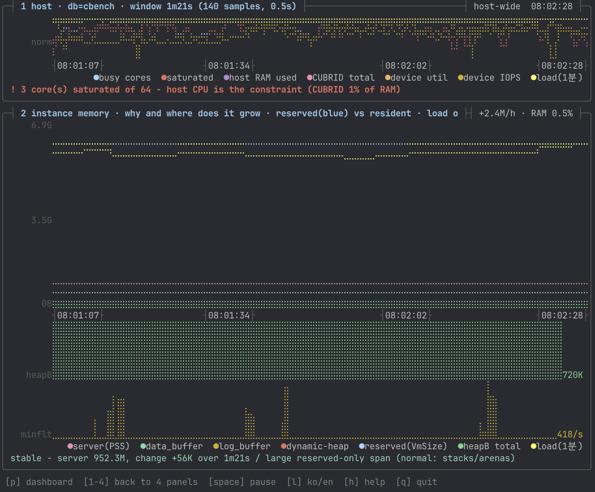
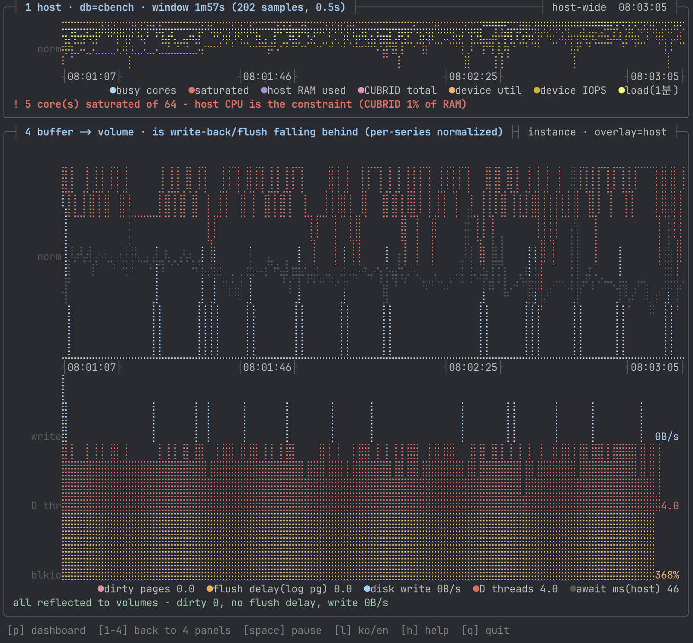

# 뷰와 키 바인딩 (Views & Keys)

네 개 뷰가 같은 수집 결과를 서로 다른 방식으로 렌더합니다. 값의 출처는 하나이며,
뷰가 달라도 같은 지표는 같은 값이어야 합니다(대조: [`tools/check-hist.sh`](../tools/check-hist.sh)).

| 실행 | 뷰 | 성격 | 용도 |
|---|---|---|---|
| `./cub_top -t` (`--tty`) | 드릴다운 트리 | 1회 | 계층 전체를 한눈에 (터미널용) |
| `./cub_top -b` (`-i`, `--live`) | btop형 대시보드 | 라이브 | 상시 모니터링 |
| `./cub_top -d` (`--dump`) | key=value 덤프 | 1회 | 모니터링 연동·백데이터 |
| `./cub_top -p` | 시계열 플롯 (4패널) | 라이브 | 시간에 따른 변화·추세 |
| `./cub_top --dump-json` | JSON 오브젝트 | 1회 | `-d` 와 키·순서 동일 |
| `--heap` (모드와 함께) | 위 + 방법 A 힙 분해 | 1회/라이브 | 동적 힙 내부까지 |
| `./cub_top --replay F` | 기록 재생 | 라이브와 동일 | 지난 순간을 그대로 다시 봄 (`-d`/`--dump-json` 으로 프레임별 덤프) |
| `./cub_top` | 도움말 | — | 출력 모드가 없으면 옵션 목록을 낸다 (`-h` 와 같음) |

출력 모드는 한 번에 하나다(`-t` · `-d`/`--dump-json` · `-b`/`-p`). DB 이름이나 다른 옵션만 주고 모드를 빼면
도움말을 내고 종료 코드 2 로 끝난다.

공통 옵션: `--interval S`(샘플 창, 기본 0.5초) · `--heap`(1회 모드에서 방법 A 포함) · `--hot`(최근접근 측정, 기본 OFF) · `--ascii`/`--ko`(라벨 강제) · `--record F`(라이브 프레임 기록) · `--dump-hist`(히스토리 1샘플을 stderr 로, 수치 대조용)

### 옵션 표기와 도움말

**어떤 옵션으로 돌았는지**를 매 실행마다 첫 줄에 남깁니다.
알 수 없는 옵션은 표기 전에 오류(종료 코드 2)로 막으므로, 첫 줄에 보이는 옵션이 곧 적용된 옵션입니다.

```
$ ./cub_top -t --heap
옵션 -t --heap   ·   실시간 화면: cub_top -b · 시계열: -p · 동적 메모리 상세: --heap · 모니터링 연동: -d · 도움말: -h

[@demodb]
CUBRID 메모리 드릴다운 (C)  db=demodb  pid=1951163  ⏱ 2026-09-30 07:27:53
```

| 모드 | 표기 방식 |
|---|---|
| 드릴다운 | 첫 줄에 `옵션 … · 실시간 화면: … · -h 도움말` |
| 덤프(`-d`/`--dump-json`) | `opts.used="-d --heap"` (기계 파싱용, 사용 가능 목록은 넣지 않음) |
| 라이브(`-b`/`-p`) | 화면을 지우므로 배너 대신 **`h` 도움말**에 `이번 실행` + 전체 옵션 목록 |

`-h` · `--help` · `/h`(`-?`/`/?`도 허용)는 사용법과 옵션 목록을 그 자리에 출력합니다(화면을 지우거나 넘기지 않음).
화면별 해설은 라이브(`-b`/`-p`) 안의 `h` 도움말에 있습니다. 옵션 목록은 소스의 명세 표
하나(`OPTSPEC` / `OPTS[]`)에서 배너·도움말·인식 목록이 모두 파생되므로, 옵션을 추가하면
세 곳이 자동으로 함께 갱신됩니다.

---

## 1. 드릴다운 트리 (`-t`)

계층을 그대로 트리로 펼칩니다. 관측 등급이 각 노드에 붙습니다.

```
OS RAM  188.0G
├─ used  98.3G (52%)
├─ cached  110.9G
├─ avail  89.7G
├─ swap  off
└─ CUBRID engine  1.7G (0.90% of RAM)
   ├─ ● server+master  1.6G
   │  ├─ ● data_buffer  572.8M / alloc 580.8M  (설정 512.0M, 112%)  핫 0%
   │  ├─ ● log_buffer  262.0M / alloc 270.1M  (설정 256.0M, 102%)
   │  ├─ ? dynamic-heap  732.6M / alloc 766.8M  핫 1%
   │  │  ├─ ● [B] plan cache (xcache)  76K
   │  │  ├─ ● [B] session table  30K
   │  │  ├─ ◌ [A] page-pair block  625.6M
   │  │  └─ ◌ [A] db_private heap base  27.9M
   │  ├─ ◐ thread stacks  796K / alloc 368.1M  핫 12%
   │  ├─ ● code (.so)  16.2M / alloc 29.5M
   │  ├─ ◐ glibc arena  0B / alloc 3.3G
   │  └─ ◐ PL server(JVM) — 서버가 기동하는 별도 프로세스  89.0M
   └─ ● broker+CAS (3-tier 별도 계층)  15.6M
```

## 용어 주의 — "힙"과 "BCB"

| 표기 | 뜻 | 혼동하기 쉬운 것 |
|---|---|---|
| **동적 메모리 상세**(구 "힙 상세") | 프로세스의 **glibc malloc 힙** = 동적 할당 영역. 영역 이름 `dynamic-heap` 과 같은 대상 | CUBRID 스토리지의 **힙 파일**(HFID, 테이블 데이터가 저장되는 구조)과는 다르다. 그쪽은 `cub_volmap` 이 다룬다 |
| **BCB** | **B**uffer **C**ontrol **B**lock = 버퍼풀의 페이지 슬롯 한 장마다 붙는 관리 구조체(`struct pgbuf_bcb`). 그 슬롯의 VPID·dirty·LRU 존을 담는다 | 화면에는 "페이지 슬롯(BCB)" 으로 풀어 적는다 |

## 2. btop 대시보드 (`-b`)

고정 그리드. btop의 문법(둥근 박스 + 그라디언트 미터 + 브라유 그래프)을 차용했습니다.

```
 수집 23ms                        2026-09-02 02:26 AM        상단 상태줄(프레임 수집시간 · 시각)
╭─┤ OS 컨텍스트 · load .. ├──┤ total|used|pct|avail|cache|swap ├╮  L0 호스트 — CPU 코어분포·포화 N·메모리·인스턴스별
╭─┤ PSS · 프로세스 ├──────────────────┤ Δ3m00s │ All ..M ├╮  L1 티어(master/server/PL/broker/CAS) + 코어 수 + Δ(관측창)·스파크라인
╭─┤ RSS · 서버 ├┤ 설정으로 설명 N% ├──┤보기1 · 할당/상주 ┤─┤ alloc|rss|hot|grow ├╮  L2 영역별 게이지 · 값 4열
╭─┤ 동적 메모리 상세 · 엔진이 직접 보고(B) ├╮╭─┤ 동적 메모리 상세 · 크기 추정(A) — HH:MM:SS chked ├╮  L3 힙 분해(좌우 우열 없음)
╭─┤ 버퍼풀 · 페이지 슬롯 — 버퍼 제어블록 ├────────────────╮  슬롯 상주·dirty·존·로그 LSA·볼륨별 상주 (아래 절)
╭─┤ 메모리 추이 · load(OS) · 관측창 3분 · [p] 시계열 전체 ├╮  = 시계열 2번 패널 축소판(같은 함수·판정문, §3)
╭─┤ I/O · cub_server + 최다사용 장치 ├───────────────────╮  iowait(OS)·디스크·판정문(최근 2건 유지)
╰────────────────────────────────────────────────────────╯
```


실제 화면(`cbench`, 영문 라벨).

세로 순서는 **범위가 넓은 것 → 좁은 것**입니다. 머신(OS) → 프로세스 티어 → 서버 내부 영역 →
힙 내부 분해로 좁혀 들어가고, 마지막 두 박스가 "지금 어떤가(I/O)"와 "어디로 가는가(성장)"입니다.

**프로세스 박스의 추이 열**: 행마다 `Δ<관측창>`(관측창 첫 표본 대비 증감, 0.1% 미만이고 1MB 미만이면 `·`)과
스파크라인(폭 100칸 이상 24칸, 80칸 이상 12칸 — 게이지를 절반으로 줄여 확보; 게이지와 값 열은 같은 정보라 손실 없음)을 둔다.
스파크라인 척도는 **관측창 min–max**(0 기준이면 상주 메모리처럼 최댓값 근처에서만 움직이는 값이 늘 맨 위 점에 붙어 변화를 못 보인다).
진폭 0.5% 미만은 회색 가운데 직선 = 평탄. 크기는 스파크라인이 아니라 옆 Δ 숫자로 읽는다(증폭 착시 방지). 축 라벨은 두지 않는다.
broker·CAS·PL 이 "커지고 있는가"도 이 열에서 읽는다.
색은 A 판정문과 같은 규칙 — +5% 이상인데 load 가 평탄하면 적색(누수 의심), load 도 함께 오르면 주황(부하 기인), 감소는 청록.
메모리 추이 박스(영역 축)와는 축이 다르므로 합치지 않는다: 프로세스 박스 = 누가, 추이 박스 = 서버 안의 무엇이.

**압축 배치(자동)**: 전폭 배치에 필요한 행 수(OS + 프로세스 7 + 영역 + 힙 11 + 버퍼풀 6 + 추이 7 + I/O 약 9 + 헤더·키 3)가
터미널 행 수보다 크고 폭이 100칸 이상이면, 프로세스 박스를 왼쪽 반쪽(이름 열 14칸·스파크 8칸·게이지 생략)에, 메모리 추이 미니를
오른쪽 반쪽(차트 4행, 범례는 이름만)에 나란히 그리고 **판정문은 두 박스 아래 전폭 1행**으로 둔다. 14행 → 8행. 반쪽에 판정문을
넣으면 결론부가 잘리기 때문에 전폭으로 뺐다. 행이 넉넉하면 전폭 배치 그대로다(스파크 24칸·범례 값·판정문 포함).

**시각 표기**: 상단 OS 박스의 우측 테두리에 날짜+12시간제, 메모리 추이 박스 안(차트 아래·범례 위)에 24시간제
눈금(날짜 없음). 눈금은 그래프와 같은 x 범위에 놓여 곡선 바로 아래에 정렬됩니다(박스 8행).

`동적 메모리 상세 · 크기 추정(A)`와 `동적 메모리 상세 · 엔진이 직접 보고(B)`를 **좌우로 나란히** 둔 것은 같은 대상을 두 방법으로 본 것이므로 순서(우열)를 만들지 않기 위함입니다. A 박스 하단에는 `A 합계(청크)`와 함께 `과대계상(free+비상주)` 차이를 남깁니다 — 이게 없으면 대시보드가 힙을 전부 설명한 척하게 됩니다.

### 보기 (`1`~`3`, 구 명칭 "렌즈")

박스 배치를 바꾸지 않고 **게이지와 퍼센트만** 교체합니다. 눈이 위치를 기억한 채 축만 갈아끼울 수 있게 하려는 의도입니다.

**값 4열은 보기와 무관하게 항상 `alloc | rss | hot | grow`로 고정**됩니다(폭 7·7·7·6 — `1023.9M` 같은 7자 값도 잘리지 않음). `grow` 는 그 보기의 축을 따르는 증감입니다 — 보기1=rss Δ, 보기2=hot Δ(+녹/-적), 보기3=alloc Δ(주황). 보기 배지·헤더 토큰·행 값이 같은 색으로 이어져 어느 축인지 즉시 보입니다.

| 키 | 게이지 / 퍼센트 | 읽는 법 |
|---|---|---|
| `1` 할당/상주 | 상주/할당 | 낮으면 예약만 하고 안 쓰는 영역 |
| `2` 핫 | 핫/상주 | 올려두고 안 만지는 메모리 — **grow 열이 hot 증감(+녹/-적)으로 바뀌고, hot·grow 헤더가 녹색**이 된다(문구는 grow 고정) |
| `3` 설정 초과 | 할당/설정 (>105% `!`) | conf 값보다 얼마나 더 매핑했나 — **hot 열이 conf(설정값) 열로, grow 는 alloc Δ 로 바뀌어**(주황) 퍼센트 축(할당/설정)과 증감이 직접 연동 |

### 배경색 = 핫 (모든 보기 상시)

게이지의 **전경 글리프는 보기 지표**, **배경색은 핫 범위**입니다. 두 채널이 직교하므로 보기를 어디에 두어도 핫이 함께 보입니다.

배경 식별을 위해 두 가지를 택했습니다.

| 요소 | 선택 | 이유 |
|---|---|---|
| 글리프 | **6점 점자** `⠿`(채움) / `⠤`(트랙) | 8점 `⣿`은 셀을 꽉 채워 배경이 거의 보이지 않음. 6점은 **하단 2행을 비워** 배경색이 띠처럼 드러남 |
| 배경색 | **어두운 청색**(256색 `18`) | 전경 그라디언트가 녹→적(따뜻한 계열)이므로 **보색인 차가운 계열**을 써야 겹쳐도 구분됨 |

`alloc ≥ rss ≥ hot`이 항상 성립하므로 배경은 **그 보기의 분모와 같은 축**에서 hot이 차지하는 범위를 칠합니다(보기1=hot/alloc, 보기2=hot/cfg, 보기3=hot/rss). 미세값도 최소 1칸으로 표시되어 사라지지 않습니다.

> `clear_refs`가 없는 환경에서는 hot이 0이므로 배경이 나타나지 않고 게이지만 동작합니다.

### 버퍼풀 · 버퍼 제어블록(BCB) 상태 읽기 박스 (힙 상세 아래, 6행)

```
╭─┤ 버퍼풀 · 버퍼 제어블록(BCB) 상태 읽기 (◌, 8ms) ├────────────────────────────────────────────╮
│ 상주      ⠿⠿⠿⠿⠿⠿⠿⠿⠿⠿⠿⠿⠿⠤⠤⠤⠤⠤⠤⠤⠤⠤⠤⠤⠤⠤⠤⠤⠤⠤  14562/32768 44%   dirty 55 (0.2%)   flushing 0 │
│ 존  hot 12882  warm 1605  cold 104  void 0  free 18177                                    │
│ 로그 append 564300|2152  flushed 564300|2152  지연 0 pg   최고령 dirty 564182|15296  span 118 pg │
│ 볼륨별(상주/dirty): vol3 10071/0d  vol1 2386/0d  vol0 2102/55d  vol2 3/0d                  │
╰──────────────────────────────────────────────────────────────────────────────╯
```

| 행 | 의미 |
|---|---|
| 상주 게이지 | 전경 = 상주율(`resident/num_buffers`), **배경(청색) = dirty 비율** — 핫 배경과 같은 채널 규약 |
| 존 | LRU hot/warm/cold + void(전이 중) + free(빈 BCB). victim 은 cold 에서, dirty 는 건너뜀 |
| 로그 | append(꼬리) · flushed(nxio, 디스크 반영 경계) · 지연(둘의 차, 로그 페이지) · 최고령 dirty LSA · span(= append 와의 거리 = flush 지연) |
| 볼륨별 | 상주 수/dirty 수, 상주 많은 순 4개 — `cub_volmap --bufmap` 의 볼륨 헤더와 같은 값 |

비활성이면 사유를 그대로 적는다(방법 B 비활성 / 표에 BCB 오프셋 없음 / 위생 위반). 지표 정의는 [metrics.md](metrics.md) 마지막 절.

### 키

| 키 | 동작 |
|---|---|
| `1`~`3` | 보기 전환 |
| `<` `>` | 인스턴스(DB) 이동 — 전환 시 분석 상태를 비우고 새로 시작 |
| `space` | 일시정지 — 수집을 중단하고 화면 고정. 상태줄에 `PAUSED` |
| `r` | 방법 A **1회** 재측정 (상태줄 표기 `힙 [r]재측정`) |
| **`a`** | 방법 A **자동 재분석 토글** — 목표 1초, 단 직전 실측의 3배 이상 간격 유지 |
| **`l`** | **한/영 라벨 전환** — 한글이 깨지는 tty, 또는 입력기가 한글로 따라가는 환경에서 (`--ascii` 와 동일) |
| **`p`** (또는 `g`) | **시계열 ↔ 대시보드 전환** (상태줄 표기 `[p]시계열`) — 히스토리는 뷰와 무관하게 계속 쌓이므로, 대시보드를 보다 `p` 를 누르면 그동안 모인 관측창이 즉시 그려집니다. 플롯 뷰에서 `1`~`4` 는 패널 확대 |
| **`h`** | **도움말** — 각 항목이 무엇을 보여주고 무엇을 알 수 있는지 (다시 누르면 복귀) |
| 도움말 안에서 | `n`/`PgDn`/`↓` 다음 · `p`/`PgUp`/`↑` 이전 · `Home`/`End` 처음/끝 |
| `q` | 종료 — **화면을 지우지 않고 마지막 프레임을 남긴다**(대체 화면 미사용) |

### I/O 의 관측 범위 — 인스턴스별 vs 호스트 전역

I/O 박스는 **범위가 다른 두 종류**를 함께 보여주므로 구분이 필요합니다.

| 행 | 출처 | 범위 |
|---|---|---|
| iowait`(OS)` | `/proc/stat` | **호스트 전역** — 코어 수로 희석되므로 우측 D스레드(이 서버 값)와 함께 읽음 |
| 디스크 읽기 / 쓰기 / IOPS / 캐시 흡수율 | `/proc/<pid>/io` | **현재 인스턴스** |
| blkio wait / D스레드 | `/proc/<pid>/task/*/stat` | **현재 인스턴스**(전 스레드 합 — 100% 초과 가능) |
| 장치 `sda(OS)` | `/proc/diskstats` | **호스트 전역** — 다른 DB·다른 프로세스의 I/O 포함 |

박스 맨 아래에는 wa·장치·인스턴스 신호를 조합한 **판정문**이 붙습니다. 조건이 풀려도
시각(`HH:MM`)과 함께 최근 2건이 남고, 지난 것은 회색으로 낮춥니다. 케이스 전체는 `-h` 의
"I/O 판정문" 절에 8조합 표로 정리되어 있습니다.

실측으로 프로세스별 분리가 확인됩니다(같은 시점, 서로 다른 두 인스턴스):

```
cbench  read_bytes: 170879029248   write_bytes: 5957025792
demodb  read_bytes:     21037056   write_bytes:   23539712
```

박스 제목이 `I/O · cub_server + 최다사용 장치` 로 범위를 밝히고, 호스트 전역 행에는
`(OS)` 를 붙입니다. 덤프(`-d`)에서는 키 접두사로 분리합니다 — `io.*` 는 현재 인스턴스,
**`hostdev.*` 는 호스트 전역**입니다.

### 한글 입력 상태에서의 키 입력

**한글 상태로 키를 눌러도 그대로 동작합니다.** 두벌식 자판 기준으로 같은 물리 키의
영문으로 접어서 처리합니다.

| 누른 키 | 처리 | | 누른 키 | 처리 |
|---|---|---|---|---|
| `ㅂ` | `q` 종료 | | `ㅗ` | `h` 도움말 |
| `ㅔ` | `p` 시계열 | | `ㅣ` | `l` 한/영 |
| `ㅁ` | `a` 방법A 자동 | | `ㄱ` | `r` 1회 재측정 |

호환 자모 전체(U+3131~U+3163, 겹자음·겹모음은 두 키로)와, IME 가 두세 번의 키 입력을 묶어 내보내는 **완성형 음절**(U+AC00~U+D7A3, 예: `하` → `g` `k`)을 같은 자판 위치의 키로 되돌립니다. 쌍자음은 소문자로 접습니다. 그 밖의 문자는 무시합니다.

**왜 IME 를 끄지 않고 이렇게 하는가**: IME 는 사용자 PC 의 OS(Windows/macOS)가 소유하고,
SSH 로는 변환이 끝난 결과만 서버에 도착합니다. **원격 프로세스가 클라이언트 입력기를 끄는
표준 이스케이프 시퀀스는 존재하지 않습니다**(DECSET 목록에 없음). 따라서 "끄려고 시도하되,
안 되는 환경을 전제로 들어온 낱자를 자판 위치로 되돌리는" 방식이 유일하게 확실합니다.

진입 시 `ESC[?2004l`(bracketed paste 해제)을 보내 조합 중 문자열이 붙여넣기로 오인되지
않게 하고, 종료 시 `ESC[?2004h` 로 되돌립니다. 이 시퀀스는 지원하는 터미널에서만 듣습니다.

또한 멀티바이트 입력의 **잔여 바이트를 반드시 소비**합니다. 한글은 UTF-8 3바이트인데
첫 바이트만 읽고 버리면 나머지 2바이트가 다음 키 입력으로 오인됩니다.

### 종료 동작과 터미널 상태

대체 화면(`?1049h`)을 쓰지 않으므로 종료 후 마지막 프레임이 그대로 남고 셸 프롬프트가 그 아래에
붙습니다. 반대급부로 **실행 시점의 화면은 한 번 지워집니다**(시작 시 `2J`).

진입·종료 시 `ESC ( B` + `SI` 로 **G0 을 ASCII 로 지정·호출**합니다. 이전 프로그램이 터미널을
CJK/라인드로잉 문자셋에 남겨둔 경우를 걷어내고, 종료 후 셸이 ASCII 상태로 돌아가게 합니다.

> **한/영 입력기(IME)는 애플리케이션이 읽거나 바꿀 수 없습니다.** 터미널이 렌더된 문자에 따라
> 입력 언어를 따라가는 환경(일부 Windows IME 구성)이거나 한글 자체가 렌더되지 않는 tty 라면
> 시작 시 `--ascii`, 또는 실행 중 **`l` 키**로 라벨을 영문으로 두십시오.
> 이 도구는 문자셋 전환 시퀀스(SO/SI·ISO-2022)를 **출력하지 않습니다**(실측 확인).

`h` 도움말은 관측 등급·각 박스 항목·보기·키를 페이저로 설명합니다. CLI 의 `cub_top -h` 도 tty 에서는 같은 페이저를 쓰고, 파이프·리다이렉트면 통짜로 덤프합니다(grep 연동 유지).

### 방법 A 의 갱신 정책

라이브에서는 **시작 시 1회 항상 측정**합니다(`--heap` 여부와 무관 — 첫 화면에 A 가 비어 있지 않게).
이후는 `r`(1회) 또는 `a`(자동)로 갱신합니다.

자동 모드는 **목표 1초**로 돌리되, 직전 실측 소요의 **3배 이상 간격**을 유지합니다. A 는 힙 크기에
비례해 시간이 늘어나므로(아래 실측), 고정 주기로 두면 화면이 A 계산에 잡아먹힙니다.

| 상황 | 방법 A 소요(실측) | 자동 주기 |
|---|---|---|
| 작은 힙(72MB, 청크 3.5만) | 약 10ms | 1초 |
| 큰 힙(6.8GB, 청크 24만) + 활성 부하 | 58~508ms | 1.5~2초 |

박스 제목이 현재 상태를 그대로 표시합니다 — `동적 메모리 상세 · 크기 추정(A) — HH:MM:SS chked`
(마지막 측정 시각), 자동 모드면 주기(`[a]uto Ns`)가 함께 붙습니다. 폭이 좁으면 키 안내부터
줄이고 시각은 끝까지 남깁니다. 인스턴스가 재시작되면 A 를 즉시 1회 다시 잽니다.

> 이 소요 시간은 **청크 헤더 집어읽기** 방식의 값입니다. 힙 전체를 복사하는 창 방식은 같은 조건에서
> 1,617ms 입니다(청크·바이트 결과는 동일). 자세한 원리는 [methods.md](methods.md) 참조.

## 3. 시계열 플롯 (`-p`) — 4패널 + 한 줄 판정문

`-p` 로 바로 진입하거나, 라이브 대시보드에서 `p` 를 눌러 전환합니다. **질문 하나 = 패널 하나** 원칙으로
4패널을 두고, 각 패널 아래에 현재 상태를 한 줄로 해석한 **판정문**을 둡니다. 패널 순서는 질의 데이터가 흐르는
순서(호스트 → 메모리 → 볼륨→버퍼 → 버퍼→볼륨)이며, 1번만 **호스트 전체**, 2~4번은 **선택된 인스턴스**입니다.


| 패널 | 답하는 질문 | 주 계열 | 겹침(회색, 호스트) | 우측 숫자 |
|---|---|---|---|---|
| **1 host** | 호스트 자원 중 무엇이 제약인가 | 사용 코어 · 포화 코어 · 호스트 RAM · CUBRID 총합 · 장치 사용률 · 장치 IOPS · load1 | – | 시각 |
| **2 instance memory** | 서버 메모리가 왜·어디서 느나 | server(PSS) · data_buffer · log_buffer · dynamic-heap · 예약(VmSize) · heapB 합계 | load1 | `+X/h · RAM n%` |
| **3 volume → buffer** | 버퍼가 일하고 있나 (읽기 경로) | (계열별 정규화) 디스크 읽기 · 버퍼 상주% · cold 존% · 적재 pg/s · 핫% · 캐시 흡수% | 장치 사용률 | – |
| **4 buffer → volume** | 반영·flush 가 밀리나 (쓰기 경로) | (계열별 정규화) dirty 페이지 · flush 지연(로그pg) · 디스크 쓰기 · D스레드 | await ms | – |

2 의 server 는 대시보드 프로세스 박스·추이 박스와 같은 **PSS** 기준입니다(항등식 `db+lg+dyn+etc == RSS` 는 check-hist 가 RSS 축으로 계속 검사).
정규화 패널(3·4)은 공통 세로 눈금을 찍지 않고 `norm` 이라고 표기합니다 — 모양(추세·동시성)만 겹치고 값은 범례에서 읽습니다.

### 판정문 규칙

I/O 박스 판정문과 같은 규약입니다: 성립한 신호만 근거로 적고, 임계는 관측창·코어 수 대비로 잡고, 확실하지 않으면 사실만 나열합니다.
`⚠`(적/주황) = 조치 신호, `·` = 사실 진술, 녹색 = 정상 확인.

| 패널 | 조건 | 판정문(예) |
|---|---|---|
| 1 | 포화 코어 ≥ 1 | ⚠ 포화 코어 N/M개 — 호스트 CPU 가 제약 (CUBRID 는 RAM 의 n%) |
| 1 | load1 > 코어×1.2 | ⚠ load X > 코어 N — 실행 대기 큐 존재(호스트 전체) |
| 1 | 장치 ≥ 80% | ⚠ 장치 n% — 호스트 스토리지가 제약 (이 인스턴스 몫은 3·4번 패널에서) |
| 1 | 호스트 RAM > 92% / 그 외 | ⚠ 호스트 RAM n% 사용 — 여유가 적다 / · 호스트 정상 — 사용 코어·RAM·장치 |
| 2 | 관측창 동안 서버 +5% 이상, load 도 30% 이상 상승 | ⚠ 서버 +X (+Y/h) · load 도 함께 상승 → 부하 기인 증가 |
| 2 | 서버 +5% 이상, load 평탄 | ⚠ 서버 +X (+Y/h) · load 평탄 → 부하와 무관한 증가 — 동적 메모리 상세(B/A) 확인 |
| 2 | −5% 이하 / 그 외 | · 서버 −X — 작업 메모리·캐시 반납 / · 안정 — 서버 X, 변동 ±Y (창) (+ 예약만 한 분량 큼 주석) |
| 3 | 버퍼풀 상태 읽기 비활성 | · 버퍼풀 상태 읽기 비활성 — 읽기, 흡수율 |
| 3 | 상주 < 90% | · 버퍼 채우는 중 (상주 n%) — 히트율 판단 보류 |
| 3 | 읽기 ≥ 8MB/s 이고 재적재 ≥ 30% | ⚠ 버퍼 부족 — 재적재 n%·읽기 X/s: 작업집합이 버퍼보다 크다, 증설이 듣는다 |
| 3 | 읽기 ≥ 8MB/s 이고 cold 존 ≥ 80% (재적재 < 30%) | ⚠ 재사용 없는 스캔 — 버퍼를 키워도 읽기가 줄지 않음 |
| 3 | 읽기 < 1MB/s / 그 외 | · 버퍼에서 처리 중 / · 작업집합 교체 중 |
| 4 | 로그 fsync 지연 > 0 | ⚠ fsync 지연 N 로그pg — 커밋 지연 위험 |
| 4 | 장치 ≥ 80% 이고 쓰기 ≥ 1MB/s | ⚠ 쓰기 병목 — 장치·쓰기·dirty |
| 4 | dirty ≥ 100 이고 창 최소의 1.5배 초과 | ⚠ dirty 누적 N — 체크포인트·flush 가 따라잡기 전까지 증가 |
| 4 | dirty 0 / 그 외 | · 볼륨 반영 완료 / · dirty N · flush 지연 · 장치 n% · 쓰기 X/s |

3번 패널에서 cold 존 점유만으로는 "버퍼 부족"과 "스캔"을 가를 수 없습니다 — 둘 다 cold 가 높습니다.
가르는 것은 **재적재율**(쫓겨났다가 다시 읽힌 페이지의 비율)이라, 그 조건을 먼저 봅니다.

### 키와 높이

- `2`~`4`: 그 패널을 확대하고 1번 호스트 패널은 위에 축소해 남깁니다. `1`(또는 같은 키를 다시)로 4패널 복귀. 대시보드의 `1`~`3` 보기 전환과 다른 뜻이며 플롯 뷰에서만 그렇게 동작합니다.
- **줌 하단 보조 막대는 4점 점자**. 블록 문자(▁▂▃▄▅▆▇█)는 한 셀이 가로 1표본·세로 8단계였는데,
  점자는 한 셀에 **가로 2표본**을 담아 같은 폭에서 시간 해상도가 2배가 되고 위 선 차트와 글리프 가족이 같아 층이 자연스럽게 이어집니다.
  세로는 셀당 4단계(계열당 N행이면 4N단계). 값이 있으면 최소 1점을 켜서 작은 값이 사라지지 않습니다.
  점자 해상도가 높아진 만큼 **계열당 행을 1줄씩 줄여**(줌 시 계열당 1~5행) 남는 행을 주 차트에 돌려줍니다.
- **시간축은 패널마다** 차트 바로 아래(범례 위)에 1행씩 둡니다. 화면 맨 아래 한 줄로는 어느 패널의 어느 지점이 몇 시인지
  눈이 세로로 오래 이동해야 했습니다. 패널 = 제목 1 + 차트 ch + 눈금 1 + 범례 1 + 판정문 1 + 테두리 1 = ch+5 행.
- 높이가 모자라면 패널을 버리지 않고 차트 행수(ch)를 8→2 까지 줄입니다. 헤더 2행과 하단 키 1행은 항상 남습니다.
- 대시보드의 **메모리 추이 박스는 2번 패널의 3행 축소판**입니다(같은 렌더 함수·같은 판정문, 할당 선만 생략). 제목에 `[p] 시계열 전체` 로 가는 길을 적어 둡니다.

### 이 뷰가 지키는 규칙

- **표본이 2개 미만이면 선을 그리지 않습니다.** 대신 "표본이 부족합니다"를 표시합니다.
  점 하나를 찍어 놓고 그래프인 척하지 않습니다. 헤더에 항상 `관측창 Ns (샘플 N개, 간격 S초)`
  를 표기하므로, 선이 짧은 것이 결함이 아니라 아직 모으는 중임을 알 수 있습니다.
- **정규화 패널(3·4번)은 세로 눈금을 찍지 않습니다.** 퍼센트와 회/s 는 단위가 달라 한 축에 겹치면
  큰 쪽이 작은 쪽을 바닥에 눌러 버립니다. 계열별로 자기 최대에 맞춰 정규화하고,
  실제 값은 범례에 둡니다. 공통 눈금이 없으므로 찍으면 그것이 거짓말이 됩니다.
- **캐시 흡수율은 유휴 구간에 0 으로 그립니다.** 읽기량이 하한 미달이면 비율이 무의미한데
  100% 로 그리면 캐시가 완벽한 것으로 오독됩니다. 0 과 "측정 불가"가 같은 픽셀이 되므로
  그 구간에는 범례 옆에 각주를 답니다.
- **핫 측정이 꺼져 있으면(기본) 3번에서 핫 계열을 빼고** 제목 우측에 사유를 적습니다. 0 선을 그려 놓고
  "핫이 없다"로 읽히게 두지 않습니다.
- **관측창 밖으로 밀린 표본은 피크를 보존해 축약합니다.** 표본이 가로 픽셀보다 많으면
  구간 최대를 취하므로, 균등 샘플이었다면 사라졌을 폴트·I/O 스파이크가 남습니다.
- **60칸 미만 터미널에서는 그리지 않고** 필요 폭을 안내합니다. 깨진 화면보다 낫습니다.

### 값의 출처

플롯이 쓰는 값은 전부 히스토리 링버퍼(`HS[]`)에서 오고, 링버퍼는 영역 분류 결과를
**이름으로** 조회해 채웁니다(`sr_rss("data_buffer")` 등). 인덱스(`SR[0]`)로 집으면
`data_buffer` 가 검출되지 않은 순간 다른 영역 값이 그 라벨 아래 조용히 들어갑니다.
`--dump-hist` 는 이 샘플을 stderr 로 내보내며, [`tools/check-hist.sh`](../tools/check-hist.sh)
가 같은 시점의 덤프(`-d`) 출력과 13개 항목 + 항등식(`db+lg+dyn+기타 = server 상주`)을 대조합니다.

## 4. 덤프 (`-d`, `--dump-json`)

파싱 가능한 `key=value` 한 줄씩. 모니터링 시스템 연동이나 분석 도구 입력용입니다.

```
ts="2026-08-21 01:49:33" ts_epoch=1787...
os.ram_total_kb=197179440 os.ram_used_kb=... os.swap_total_kb=0
server.db=cbench server.pid=656016 server.mapped_kb=... server.rss_kb=...
param.data_buffer_size.kind=region param.data_buffer_size.cfg_bytes=536870912 \
  param.data_buffer_size.mapped_bytes=... param.data_buffer_size.rss_bytes=... \
  param.data_buffer_size.resident_pct=99.0 param.data_buffer_size.over_pct=112.5 \
  param.data_buffer_size.hot_pct=0.3
dynamic_heap.mapped_bytes=... dynamic_heap.rss_bytes=...
io.read_bps=567649972 io.write_bps=15677 io.rchar_bps=525931751 \
  io.read_iops=32232 io.cache_absorb_pct=0.0 io.blkio_wait_pct=0.00 \
  io.total_read_bytes=... io.total_write_bytes=...
io.dev_name=sda io.dev_util_pct=99.9 io.dev_read_bps=... io.dev_write_bps=...
total.cubrid_pss_bytes=... total.cubrid_pct_ram=0.90
cache.tid=... cache.l1_miss_per_s=... cache.l2_miss_per_s=... cache.l3_miss_per_s=...
pgbuf.enabled=1 pgbuf.reason="BCB 배열 상태 읽기(32768개)"
pgbuf.num_buffers=32768 pgbuf.resident=14562 pgbuf.dirty=55 pgbuf.flushing=0 \
  pgbuf.zone1_hot=12882 pgbuf.zone2_warm=1605 pgbuf.zone3_cold=104 pgbuf.zone_void=0 pgbuf.zone_free=18177 \
  pgbuf.hdr_mismatch=0 pgbuf.hdr_unread=0 pgbuf.scan_ms=8.2
pgbuf.vol0.resident=2102 pgbuf.vol0.dirty=55
pgbuf.oldest_dirty_pageid=564182 pgbuf.oldest_dirty_offset=15296
log.append_pageid=564300 log.append_offset=2152 log.nxio_pageid=564300 log.nxio_offset=2152 \
  log.eof_pageid=564300 log.eof_offset=2152 log.flush_lag_pages=0 log.dirty_span_pages=118
```

`pgbuf.*`/`log.*` 는 `--bcb-dump FILE` 스냅샷과 같은 원천이다(정의는 [metrics.md](metrics.md)).

키는 전부 ASCII이며, 측정 시각이 `ts`/`ts_epoch`로 항상 포함됩니다(메모리는 휘발성이라 시점 없는 값은 무의미).

## 5. heapbreak 단독 (`heapbreak.py`)

동적 힙만 방법 B/A로 분해해 표로 출력합니다. `cub_top.py`에 import되어 쓰이기도 하고, 단독 실행도 됩니다.

```
 [B · 루트 전역 순회 — 정확]
 ● plan cache (xcache)             44K   entries=1
 ● session table                   30K   alloc_cnt=100×312
 [A · 힙 크기 히스토그램 — 잔여 분류]  (청크 33,053개, 걷은 힙 67.2M)
   db_private heap base (64K/thr)              27.9M
   query working mem (64K~1M)                  15.0M
```

## 렌더링 참고 — 프레임 출력 방식

캔버스는 행마다 **절대 좌표(`ESC[y;1H`)** 로 찍고 개행을 쓰지 않는다. 행마다 `\n` 으로 내려가면
캔버스가 터미널보다 길거나 마지막 행에서 개행이 날 때 화면이 한 줄 스크롤되고 다음 프레임에 `ESC[H` 로
되돌아오므로, 맨 위 OS 컨텍스트 박스가 매 프레임 밀려났다 돌아오며 깜빡인다.

| 상황 | 동작 |
|---|---|
| 터미널이 캔버스보다 길다 | 캔버스 아래 `ESC[J` 로 잔상만 지운다 |
| 터미널이 짧다 | 캔버스는 **마지막 2행 위까지만** 그리고 아래 박스가 잘린다. 하단 2행은 항상 키 안내가 덮는다(빈 줄 1 + 키 1). 키 안내 끝에 `▼N` = 가려진 행 수 |
| 플롯 뷰 | 같은 방식, 패널 높이는 이미 터미널에 맞춰 계산되므로 보통 잘리지 않는다 |

스크롤이 전혀 일어나지 않으므로 어느 높이에서도 화면이 꽉 찬 채로 고정되고, 대체 화면(1049h)을 쓰지 않는
기존 원칙(q 뒤 마지막 프레임 유지)도 그대로다.

- **폭** 96열 × 34행 이상 권장. 폭에 따라 게이지·시간축 눈금 수가 자동 조정됩니다.
- **색상** TTY 가 아니면 자동으로 무색 출력(파일·파이프 안전).
- **글리프** 미터는 6점 점자(`⠿`/`⠤`), 그래프는 브라유 2×4점. 폰트가 점자를 대체하는 터미널에서는 블록(`█`)으로 바꾸는 것이 안전합니다.
- **캔버스 내 한글 허용(조건부)** — 캔버스 셀 모델은 전각을 2칸으로 잡고 다음 칸을 sentinel 로 소비하므로
  한글 자체는 문제가 없습니다. 테두리를 깨는 것은 **문자 수 기준 패딩**으로, 전각에서 어긋나
  뒤 컬럼을 밀어냅니다. 표시 폭 기준 패딩(`pad()`)을 쓰는 한 한글 라벨을
  캔버스 안에 둘 수 있습니다(전 보기 96칸 균일·미완결 0줄 실측 확인).
  다만 **파라미터·영역 식별자는 ASCII 유지** — `cubrid.conf` 이름과 1:1로 대응해야 합니다.

## 라이브 배경색 (밝은 테마 대응)
라이브 진입 시 터미널 기본 전경/배경을 어두운 조합(#d8d8d8/#1c1c1c)으로 바꾸고 종료 시 원색으로 되돌린다.
OSC 10/11 질의에 응답하는 터미널에서만 동작(무응답 = 미지원으로 보고 무변경). ssh 를 거쳐도 로컬 터미널이 처리한다.
주의: 대체 화면을 안 쓰므로 종료 후 남는 마지막 프레임은 원래(밝은) 배경 위에 보인다.

## 도움말(h)의 모드 분리
라이브 h 도움말은 지금 보고 있는 화면의 키 절을 맨 앞에 둔다:
- 대시보드에서 h → "대시보드 키" 절(1/2/3 보기, r·a, <>, p, hot vs grow)
- 시계열에서 h → "시계열 키" 절(4패널 A~D, 1~4 확대, <>, p)
전환 키 p 만 양쪽에 있어 서로 오간다. 개념·화면구성·판정문 등 공통 설명은 그 뒤에 이어진다.
CLI `-h` 는 사용법과 옵션 목록만 낸다(해설 절은 라이브 h 에만 있다).

## 도움말 페이징 (h)
라이브 h 는 절 단위로 페이지를 나눈다 — 절 제목이 페이지 끝 4줄 안에 걸리면 다음 페이지로 넘기고,
모드 도움말은 [화면 읽기] → [키] → (대시보드는 [보기 1/2/3 과 열 의미]) → 공통 개념 순으로 한 절이 한 페이지다.
푸터에 `n/N · 절 제목` 이 보인다. 표는 한글 2칸 폭을 계산해 열을 맞춘다.

## 시계열 패널 범위
1번은 **호스트 전체**(CPU 사용·포화 코어, 호스트 RAM 사용, CUBRID 총합, 장치 사용률, load),
2~4번은 **선택된 인스턴스**(2 메모리 · 3 볼륨→버퍼 · 4 버퍼→볼륨)다.
범위를 섞으면 같은 화면에서 두 축을 견주다 오독하므로 1번에 호스트 축을 모았다.
1번 판정문은 "머신 차원인가 이 DB 인가"를 가른다(포화 코어/load/장치/RAM 헤드룸).

줌(2~4)은 **1번을 항상 위에 남기고** 그 아래를 확대 대상에 준다 —
호스트 상황을 모르면 인스턴스 지표만 크게 봐도 원인을 못 가른다.

## 도움말 구성
모드별 도움말은 그 모드만으로 완결된다 — 다른 모드의 화면 설명은 넣지 않고,
공통으로 알아야 하는 것(관측 등급·환경변수·인스턴스)은 양쪽에 각각 담는다.
서술 순서는 화면 출력 순서와 같다: 대시보드는 ①~⑥ 상자 순, 시계열은 1~4 패널 순.
페이지는 절 단위로 나누고(제목은 반드시 본문과 같은 페이지에서 시작),
대시보드 10페이지·시계열 7페이지다.

## 시계열 I/O 통합 방식 (방안 A,
I/O 는 별도 패널로 추가하지 않고 3·4 패널에 녹였다 — 3·4 는 이미 I/O 경로 그 자체이므로
(3=볼륨→버퍼 읽기 경로, 4=버퍼→볼륨 쓰기 경로) 따로 빼면 "읽기가 왜 늘었나(버퍼 미스)" 라는
인과가 끊긴다.

범위 분리는 표시 방식으로 한다:
- 주 계열(실선) = **이 인스턴스** — 3: 디스크 읽기·상주%·cold%·핫%·적재 pg/s·majflt/s,
  4: dirty·flush 지연·디스크 쓰기·**D스레드**
- 겹침선(회색) = **호스트** — 3: 장치 사용률, 4: await ms
  (겹침은 자기 최대로 따로 정규화되고 범례에 실값이 남는다. 제목 배지 `이 인스턴스 · 겹침=호스트`)

인스턴스 쓰기와 호스트 await 는 같은 축의 실선으로 섞지 않는다(오독 방지).
D스레드는 코어 수에 희석되지 않아 대기가 있으면 반드시 잡히는 유일한 인스턴스 지표이므로
4 패널 주 계열로 둔다. 1 패널에는 장치 IOPS 를 더해 실효 상한 판정에 쓴다.

얻는 판정 두 가지: "장치는 포화인데 내 읽기는 조용" (= 남의 부하),
"내 쓰기는 평탄한데 await 급등" (= 스토리지 열화).

## 시계열 줌 키
- `2` `3` `4` : 그 패널 확대 — 화면 = [1 호스트 요약(축소)] + [확대한 패널] + 판정 근거 보조 막대
- `1` : 기본 화면(4패널) 복귀. **1 번은 확대 대상이 아니다** — 줌에서도 항상 위에 남기 때문.
- 확대한 키를 다시 눌러도 복귀.

| 확대 | 보조 막대 | 화면 |
|---|---|---|
| `2` 메모리 | heapB 합계 · minor fault/s | 아래 첫 그림 |
| `3` 볼륨 → 버퍼 | 적재 pg/s(admit) · 재적재%(readmit) · 캐시 흡수% · major fault/s | 아래 둘째 그림 |
| `4` 버퍼 → 볼륨 | 디스크 쓰기 · D스레드 · blkio% | 아래 셋째 그림 |



2번 확대 — 서버는 1분 21초 동안 +56K 로 안정, heapB(엔진이 직접 보고한 동적 메모리)는 720K 로 평탄하고
minor fault 가 간헐적으로 튄다.


3번 확대 — 버퍼가 100% 찬 채 초당 25,438 페이지를 들이고 그 전부가 재적재다(readmit 100%). 작업집합이 버퍼보다
크다는 뜻이라 판정문이 증설을 권한다. 재적재가 낮고 cold 존만 높았다면 "재사용 없는 스캔"으로 갈렸을 것이다.



4번 확대 — dirty 0·쓰기 0B/s 로 볼륨 반영은 끝나 있다. 그런데 D스레드 4 와 blkio 368%(전 스레드 합이라 100% 를
넘을 수 있다)는 계속 높다 — 쓰기가 없으니 이 인스턴스가 기다리는 것은 **읽기**이고, 같은 시간대에 3번 패널은
초당 수백 MB 읽기와 버퍼 부족을 보이고 있다.

## 재생 화면 (`--replay`)

기록 파일을 재생하면 **대시보드·플롯 화면이 그대로** 나옵니다. 렌더러가 같고, 입력만
`/proc` 대신 파일에서 옵니다.

### 라이브와 구분되는 표시

| 위치 | 라이브 | 재생 |
|---|---|---|
| 좌상단 | `수집 23ms` | **`재생 7/17`** (주황, 현재 프레임/전체) |
| 우상단 시각 | 현재 시각 | **기록 당시 시각** |

관측 도구가 과거 데이터를 현재처럼 보여주면 안 되므로, 두 자리 모두 바꿉니다.

### 키

| 키 | 동작 |
|---|---|
| `space` | 일시정지 / 재개 |
| `.` | 다음 프레임 (정지 중) |
| `,` | 이전 프레임 (정지 중) — 히스토리를 그 지점까지 다시 쌓습니다 |
| `p` | 대시보드 ↔ 시계열 전환 |
| `1`~`4` | 플롯 패널 확대 / 대시보드 보기 전환 |
| `l` · `q` | 한영 전환 · 종료 |

`--replay-speed` 로 배속을 정합니다. `1`(기본)은 기록 당시 간격을 그대로 재현하고,
`0` 은 최대 속도로 넘깁니다. 프레임 간격이 5초를 넘으면 5초로 잘라, 기록 중간의 긴 공백을
실시간으로 기다리지 않습니다.

### 누적값도 함께 재현된다

프레임 하나의 값만 복원하면 **프레임 간에 쌓이는 값**이 사라집니다. 다음이 함께 복원됩니다.

| 누적 상태 | 복원하지 않으면 |
|---|---|
| 영역 증감 기준선 | `grow` 열이 전부 `-` |
| 용량 축(상한 매트릭스 포함) | 판정문이 **반대 결론**("상한 근접"→"여유 있음") |
| 버퍼풀 존·볼륨별 상주 | 버퍼풀 상자가 빈 채로 그려짐 |
| 동적 메모리 B 항목 | 상자가 비고 `B total 0B` |

영역 기준선은 **이름 기준**으로 이월합니다 — 인덱스로 이월하면 영역이 생기거나 사라질 때
다른 영역의 값을 물려받습니다.

