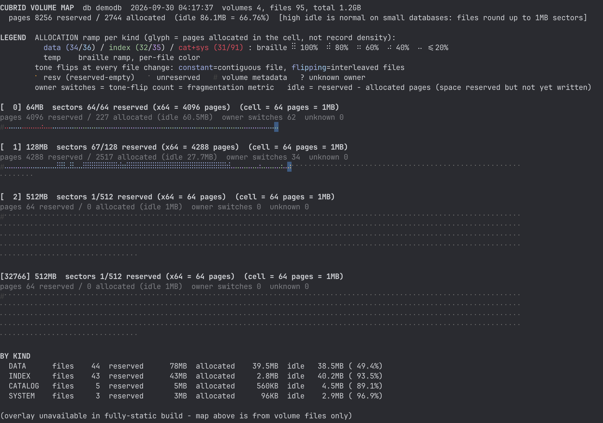
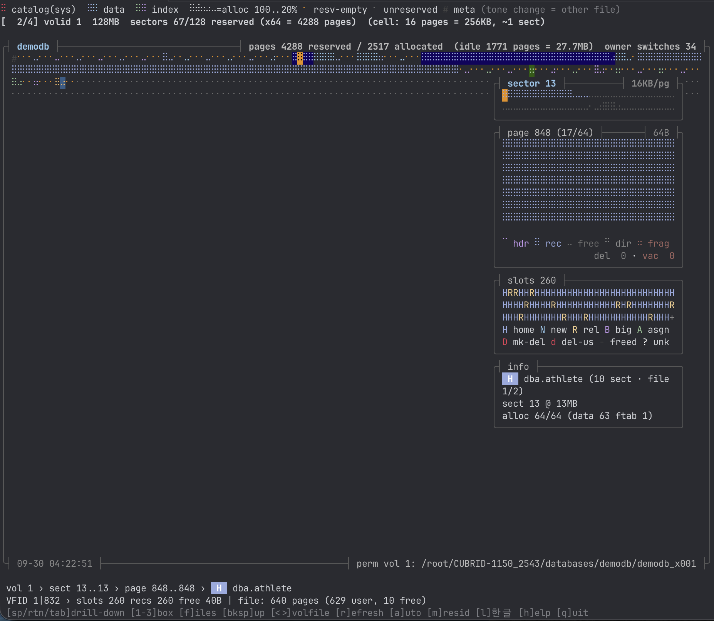
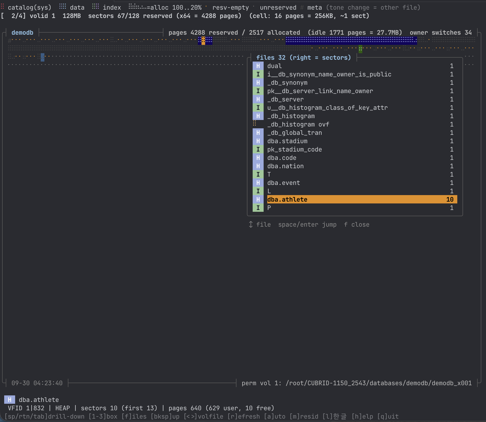

# cub_volmap

CUBRID 볼륨의 섹터·페이지 배치를 터미널 지도로 보여주는 진단 유틸리티.
**서버에 접속하지 않고** 볼륨 파일을 직접 읽는다.



배치 모드 — 볼륨별 지도와 종류별 집계(`BY KIND`)를 한 화면에 낸다.

## 무엇을 푸는가

| 질문 | 답하는 방식 |
|---|---|
| 어떤 테이블·인덱스가 볼륨 어디를 점유하는가 | 섹터별 소유 파일 색 지도 + 오프라인 객체명 해석 |
| 파일이 얼마나 섞여 있는가(조각화) | 파일 경계 톤 반전, `owner switches` 카운트 |
| 무엇부터 정비해야 하는가 | 단편화 Top-N (익스텐트 × 규모 점수, 매체 판정 병기) |
| 예약만 하고 안 쓰는 공간은 얼마인가 | `resv-empty` 글리프 + `idle` 집계 |
| 어디가 OS 캐시에 있는가 | mincore 상주율 배경색 (`-m`) |
| 어느 페이지가 서버 버퍼풀에 있는가 | `--bufmap` 중첩 (청록=상주, 자주=dirty) |
| 페이지 내부는 어떻게 생겼는가 | 섹터 → 페이지 → 슬롯 3단 드릴다운 |
| 볼륨 메타데이터는 정합적인가 | `--check`, `--format=json` |

## 특징

| | |
|---|---|
| **락 0 / 쓰기 0** | 전수 스캔 중 `cubrid lockdb` 기준 잡힌 객체 0 실측 |
| **서버 무접촉** | 볼륨 파일을 `O_RDONLY`로 해석. 페이지 버퍼·락 테이블 미접근 |
| **의존 0** | 완전 정적 1.3MB — 어느 서버에나 파일 하나로 복사 |
| **온/오프라인 무관** | 기동 중 DB와 정지된 DB에서 동일 동작 |
| **오프셋 하드코딩 0** | 페이지·볼륨 구조체는 엔진 헤더(`file_io.h` 등)를 `#include` — 오프셋은 컴파일러가 계산한다. 단 파일 디스크립터 구조체는 사본(`storage_ondisk_layout.hpp`) |
| **손상 비은폐** | 미할당은 `(unallocated)`, 이상값은 `corrupt?`로 그대로 노출 |

## 빌드

빌드본(`cub_volmap`, `cub_volmap-dyn`)이 리포에 함께 있으므로 **받아서 바로 쓸 수 있다**.
직접 빌드하려면 두 가지 방법이 있다.

### ① 소스 체크아웃 없이 — 헤더만 내려받아 빌드 (권장)

```sh
sh tools/build_fetch.sh                    # 기본 ref = develop
REF=v11.4.6.1963 sh tools/build_fetch.sh   # 특정 태그
REF=v10.2.18     sh tools/build_fetch.sh   # 구버전도 가능
```

volmap 이 포함하는 헤더 **23개**(+버전에 따라 선택 1개)만 GitHub 에서 받고,
CMake 생성물(`config.h`·`version.h`)은 스크립트가 직접 만든다.
clone·cmake·빌드 트리 모두 불필요하다.

**검증된 버전** — 전부 빌드·실행 확인:

| 태그 | 결과 |
|---|---|
| `v10.2.18` | OK (아래 구버전 호환 참조) |
| `v11.0.16` | OK |
| `v11.2.9.0868` | OK |
| `v11.3.5.1280` | OK |
| `v11.4.6.1963` | OK |
| `develop` | OK |

### ② CUBRID 소스가 이미 있을 때

```sh
SRC=/path/to/cubrid-src bash tools/build_standalone.sh
```

`BUILD` 기본값은 `$SRC/build_release` 이다. **CMake 를 한 번은 돌린 빌드 디렉터리가 필요하다**
— `config.h` 가 거기에만 있기 때문이다. 다른 위치라면 `BUILD=/path/to/build` 로 지정한다.

### 산출물

| 바이너리 | 크기 | 특성 |
|---|---:|---|
| `cub_volmap` | 1.3MB | 완전 정적, 의존 0 — **glibc 버전 요구 없음**(구 배포판 포함 어디서나 실행) |
| `cub_volmap-dyn` | 0.15MB | glibc 동적 — 런타임 `dlopen`으로 라이브 오버레이(Pass 2) 가능 |

> 정적 빌드에서 `dlopen`은 쓰지 않는다. 정적 glibc에 공유 glibc가 이중 적재되어 segfault가 난다(`-DVOLMAP_NO_DLOPEN`).

> **Pass 2 는 기본 off 다.** 이 도구의 나머지 전부는 볼륨 파일만 읽고 서버에 접속하지
> 않는데, Pass 2 만 **서버 세션을 연다**(트랜잭션 인덱스 할당 등). 그래서 `--overlay` 로
> 명시할 때만 실행한다 — 기본 실행은 `connect()` 호출이 **0건**임을 strace 로 확인했다.
>
> | 옵션 | 뜻 |
> |---|---|
> | `--overlay` | Pass 2 실행 (서버 접속) |
> | `-u, --user=NAME` | 접속 사용자 (기본 DBA) |
> | `--password=PASS` | 비밀번호 |
>
> 실패 사유는 `db_error_string()` 으로 구분해 출력한다. 예전에는 서버 정지와 비밀번호
> 오류가 **같은 문구**(`no server session`)였다.

> **Pass 2 는 빌드 버전과 같은 릴리스에서만 동작한다.** `dlopen` 한 `libcubridcs.so` 의
> `rel_major_release_string()` 을 읽어 major.minor 가 다르면 오버레이를 생략한다.
> Pass 2 는 **이 바이너리 스택의 `DB_VALUE`** 를 라이브러리에 넘기는데, 그 크기가
> 버전마다 다르기 때문이다 — **11.0 까지 64B, 11.3 부터 72B**(`DB_RESULTSET` 이
> `uint64_t` 로 넓어지고 length 필드 추가). 10.2 로 빌드한 바이너리를 11.3+ 설치본에서
> 돌리면 **스택 8바이트를 넘겨 쓴다.** 생략해도 지도·요약은 볼륨 파일만으로 완전하다.

### 구버전 호환 (build_fetch.sh 가 자동 처리)

| 차이 | 처리 |
|---|---|
| `memory_cwrapper.h` 가 11.4 부터 존재 | 선택 헤더로 두고, 없으면 건너뛴다 |
| `file_io.h` 가 lz4·lzo 헤더를 include (10.2~11.4) | volmap 은 압축 심볼을 쓰지 않으므로 빈 스텁으로 충족. 10.2 는 구조체 필드가 `lzo_uint` 타입이라 typedef 3개만 제공 |
| TDE 플래그 필드명이 10.2 는 `pflag_reserve_1`, 11.0+ 는 `pflag` | 레이아웃은 동일(prv 32B)하고 이름만 다르다. 헤더를 보고 `-Dpflag=pflag_reserve_1` 을 자동으로 붙인다 |

상세는 [docs/build.md](docs/build.md).

## 사용

```sh
cub_volmap --check --plain <db>                # 배치: 지도 + 정합성 소견
cub_volmap -i <db>                             # 인터랙티브
cub_volmap -i -m --bufmap=/tmp/bcb.dump <db>   # 캐시 + 버퍼풀 중첩
cub_volmap --check --format=json <db> -o out.json
cub_volmap --help                              # 옵션 목록
```

### 종료 코드

| 코드 | 뜻 |
|---|---|
| 0 | 정상 (소견 없음) |
| 1 | **사용법 오류** — 알 수 없는 옵션, 인자 누락, DB 두 개 지정, `--format` 값 오류 |
| 2 | `--check` / `--warn-idle` 소견 있음 |

**사용법 오류는 반드시 1로 끝난다.** 오타 난 `--chek` 를 조용히 무시하고 0으로 끝내면,
종료 코드만 보는 호출자에게 **검사가 통과한 것처럼** 보이기 때문이다 — 실제로는
요청한 검사가 아예 돌지 않았는데도.

DB 이름 대신 **vinf 경로**를 직접 줄 수 있다. 같은 이름의 DB 가 여러 설치본에 있으면
`databases.txt` 해석이 의도와 달라질 수 있어, vinf 경로가 모호함이 없다.

```sh
cub_volmap -i /path/to/databases/<db>/<db>_vinf
```



인터랙티브 모드 — 지도에서 셀을 고르면 오른쪽 4박스가 섹터 → 페이지 → 슬롯 순으로
이어서 열린다. 위 화면은 `dba.athlete` 의 페이지 848 로, 슬롯 260개가 `H`(home)와
`R`(relocation)로 섞여 있다.

### 주요 키

| 키 | 동작 |
|---|---|
| `space`·`enter` | 한 단계 드릴다운 (지도 → 섹터 → 페이지 → 슬롯 → 지도) |
| `bksp` | 한 단계 위 · `1`/`2`/`3` 박스 직행 · `tab` 열기/닫기 |
| `←→↑↓` | 박스 안 선택 (위에서 고르면 아래가 따라 바뀐다) |
| `<` `>` | 볼륨 순환 · `[` `]` 페이지 순회 |
| `f` | 파일 뷰 — 고른 파일 셀만 남색, 나머지는 회색 |
| `p` | 논리 체인 뷰 — 힙 페이지 체인 순차율·점프 통계 |
| `r` / `a` | 새로고침 / 자동 새로고침 · `m` 캐시 상주 · `b` 버퍼풀 |
| `h` | 도움말 (스크롤 문서) · `l` 한/영 · `g` ASCII 테두리 · `q` 종료 |

마우스 클릭은 인스펙션, 더블클릭은 드릴다운이다.
`[r]` 는 지도뿐 아니라 **볼륨 목록도 재스캔**한다 — temp 볼륨은 쿼리가 spill 하는 동안만
존재하므로, 새로 생긴 것은 넣고 사라진 것은 뺀다.

### temp 볼륨이 다른 디스크에 있을 때

엔진은 `temp_volume_path` 가 설정돼 있으면 **그 경로에** temp 볼륨을 만든다(없으면 DB
디렉터리). spill 볼륨을 별도 디스크에 두는 구성이 흔하므로, volmap 도 두 곳을 모두 본다.

| 우선순위 | 출처 |
|---|---|
| 1 | `--temp-path=DIR` |
| 2 | `cubrid.conf` 의 `temp_volume_path` — `[@<db>]` 가 `[common]` 보다 우선(엔진과 동일) |
| 3 | DB 디렉터리 (설정이 없을 때) |

설정 파일은 `$CUBRID_CONF_FILE`, 없으면 `$CUBRID/conf/cubrid.conf` 를 읽는다.

## 화면 읽는 법

**계층** — 볼륨 └ 섹터(64페이지=1MB) └ 페이지(16KB) └ 슬롯 └ 레코드

| 요소 | 의미 |
|---|---|
| 색 | 소유 파일 종류 (파랑=데이터 힙, 초록=인덱스, 빨강=카탈로그/시스템) |
| 채움 `⠿⠾⠶⠴⠤` | 셀 안 할당률 100/80/60/40/20% |
| 톤 반전 | 파일 경계 — 잦은 반전 = 조각화 |
| `⠂` 주황/회색 | 예약-빈 / 미예약 |
| `#` | 볼륨 메타데이터 · `?` 소유자 미상 · `E` TDE 암호 |

**슬롯 9종**: `H` home · `N` newhome · `R` relocation · `B` bigone · `D` mk-del ·
`d` del-us · `A` asgn · `-` freed · `?` unknown(손상 후보)

슬롯 구조가 아닌 페이지는 **왜 아닌지**를 함께 알린다 — `slots n/a - qresult page`.
temp 볼륨은 대부분 AREA(작업공간)·QRESULT(정렬 결과)이고, 이들은 OID 로 참조되지 않으므로
슬롯 디렉터리가 없는 것이 정상이다.



`[f]` 파일 뷰 — 이 볼륨의 섹터를 가진 파일 목록. 고른 파일(`dba.athlete`, 10섹터)의
셀만 지도에 남색으로 남고 나머지는 회색으로 죽어, 그 파일이 어디에 흩어져 있는지가
한눈에 보인다.

상세는 [docs/views.md](docs/views.md).

## 문서

| 문서 | 내용 |
|---|---|
| [docs/architecture.md](docs/architecture.md) | 2-패스 수집, 3 레인 스레드, 렌더 파이프라인 |
| [docs/views.md](docs/views.md) | 화면 구성과 글리프 문법 |
| [docs/usage.md](docs/usage.md) | 옵션·키·트러블슈팅 |
| [docs/build.md](docs/build.md) | 빌드 방법과 버전 호환 |
| [docs/ondisk-format.md](docs/ondisk-format.md) | 온디스크 구조와 버전 변천 |
| [docs/limitations.md](docs/limitations.md) | 제한 사항과 검증 매트릭스 |
| [PR.md](PR.md) | PR 본문 (PR 트리에는 올리지 않는다) |
| [archive/](archive/) | 부수 자료 — 터미널 색·글리프 진단 스크립트 (PR 트리에는 올리지 않는다) |

## 제한

- 파일 매니저 재설계(**10.1**, CBRD-20185) 이후 포맷 대상. 10.0 이하는 자기검증이 거부한다.
- 페이지 워터마크(8B)는 10.2 에서 도입됐다. 사용자 영역 크기는 로그 헤더의 릴리스로 판별해 10.1 과 10.2+ 를 구분한다 — 릴리스를 못 읽으면 10.2+ 로 가정하고 경고한다.
- TDE 볼륨의 암호화 페이지는 감지만 하고(`E`) 복호하지 않는다.
- 기동 중 DB 에서는 스냅샷과 현재 상태에 시차가 있을 수 있다(`--check` 가 소견으로 보고).
- temp 볼륨은 수명이 짧아 화면과 실제가 어긋날 수 있다. `[r]` 가 재스캔하지만 그 순간의 스냅샷이다.

## 라이선스

Apache-2.0 ([LICENSE](LICENSE)) — CUBRID 엔진·본 리포와 동일. 유래 고지는 [NOTICE](NOTICE) 참조.
